---
## Front matter
title: "Отчёт по лабораторной работе 9"
subtitle: "Архитектура компьютеров"
author: "Эйвази Мани НПИбд-03-24"

## Generic otions
lang: ru-RU
toc-title: "Содержание"

## Bibliography
bibliography: bib/cite.bib
csl: pandoc/csl/gost-r-7-0-5-2008-numeric.csl

## Pdf output format
toc: true # Table of contents
toc-depth: 2
lof: true # List of figures
lot: true # List of tables
fontsize: 12pt
linestretch: 1.5
papersize: a4
documentclass: scrreprt
## I18n polyglossia
polyglossia-lang:
  name: russian
  options:
	- spelling=modern
	- babelshorthands=true
polyglossia-otherlangs:
  name: english
## I18n babel
babel-lang: russian
babel-otherlangs: english
## Fonts
mainfont: PT Serif
romanfont: PT Serif
sansfont: PT Sans
monofont: PT Mono
mainfontoptions: Ligatures=TeX
romanfontoptions: Ligatures=TeX
sansfontoptions: Ligatures=TeX,Scale=MatchLowercase
monofontoptions: Scale=MatchLowercase,Scale=0.9
## Biblatex
biblatex: true
biblio-style: "gost-numeric"
biblatexoptions:
  - parentracker=true
  - backend=biber
  - hyperref=auto
  - language=auto
  - autolang=other*
  - citestyle=gost-numeric
## Pandoc-crossref LaTeX customization
figureTitle: "Рис."
tableTitle: "Таблица"
listingTitle: "Листинг"
lofTitle: "Список иллюстраций"
lotTitle: "Список таблиц"
lolTitle: "Листинги"
## Misc options
indent: true
header-includes:
  - \usepackage{indentfirst}
  - \usepackage{float} # keep figures where there are in the text
  - \floatplacement{figure}{H} # keep figures where there are in the text
---

# Цель работы

Целью работы является приобретение навыков написания программ с использованием подпрограмм.
Знакомство с методами отладки при помощи GDB и его основными возможностями.

# Выполнение лабораторной работы

## Реализация подпрограмм в NASM

Для выполнения лабораторной работы №9 я создал новую папку и перешел в нее. Затем я создал файл с именем lab9-1.asm.

В качестве примера была рассмотрена программа, которая вычисляет арифметическое выражение $f(x) = 2x + 7$ с использованием подпрограммы calcul. Значение переменной $x$ вводится с клавиатуры, а вычисление производится внутри подпрограммы. (рис. [-@fig:001]) (рис. [-@fig:002])

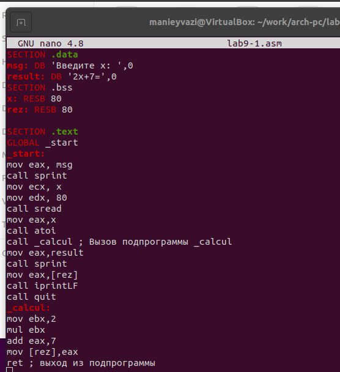{ #fig:001 width=70%, height=70% }

{ #fig:002 width=70%, height=70% }

Далее я модифицировал программу, добавив подпрограмму subcalcul внутрь подпрограммы calcul. Это позволило вычислять составное выражение $f(g(x))$, где $f(x) = 2x + 7$, а $g(x) = 3x - 1$. Значение $x$ вводится с клавиатуры. (рис. [-@fig:003]) (рис. [-@fig:004])

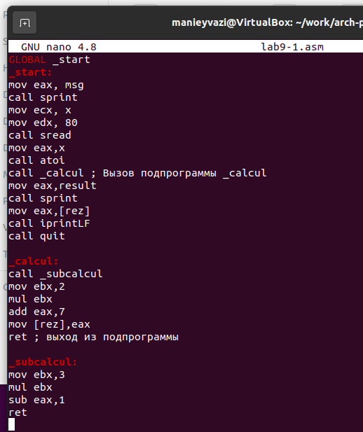{ #fig:003 width=70%, height=70% }

{ #fig:004 width=70%, height=70% }

## Отладка программы с помощью GDB

Я создал файл lab9-2.asm, в котором содержится программа из Листинга 9.2. Она отвечает за вывод сообщения "Hello world!" на экран. (рис. [-@fig:005])

{ #fig:005 width=70%, height=70% }

После компиляции с ключом -g для добавления отладочной информации я загрузил исполняемый файл в GDB. Запустил программу с помощью команды run или r. (рис. [-@fig:006])

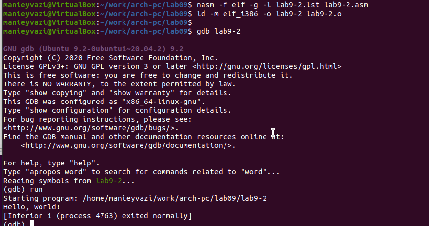{ #fig:006 width=70%, height=70% }

Для анализа программы я установил точку остановки на метке _start и запустил выполнение. Затем изучил дизассемблированный код программы. (рис. [-@fig:007]) (рис. [-@fig:008])

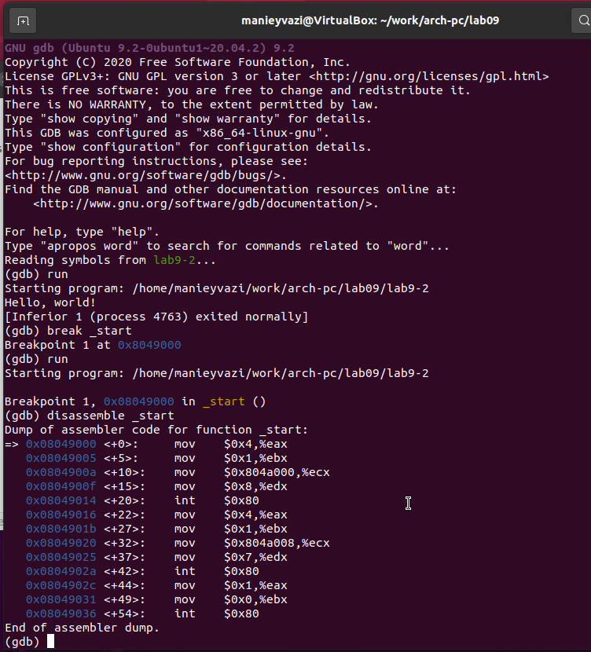{ #fig:007 width=70%, height=70% }

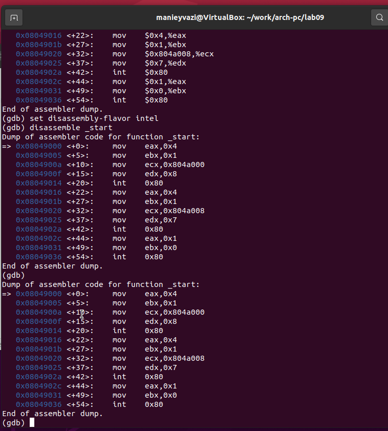{ #fig:008 width=70%, height=70% }

Для проверки точки останова я использовал команду info breakpoints (i b). Установил дополнительную точку останова по адресу инструкции mov ebx, 0x0. (рис. [-@fig:009])

{ #fig:009 width=70%, height=70% }

С помощью команды stepi (si) выполнил пошаговую отладку, отслеживая изменения регистров. (рис. [-@fig:010]) (рис. [-@fig:011])

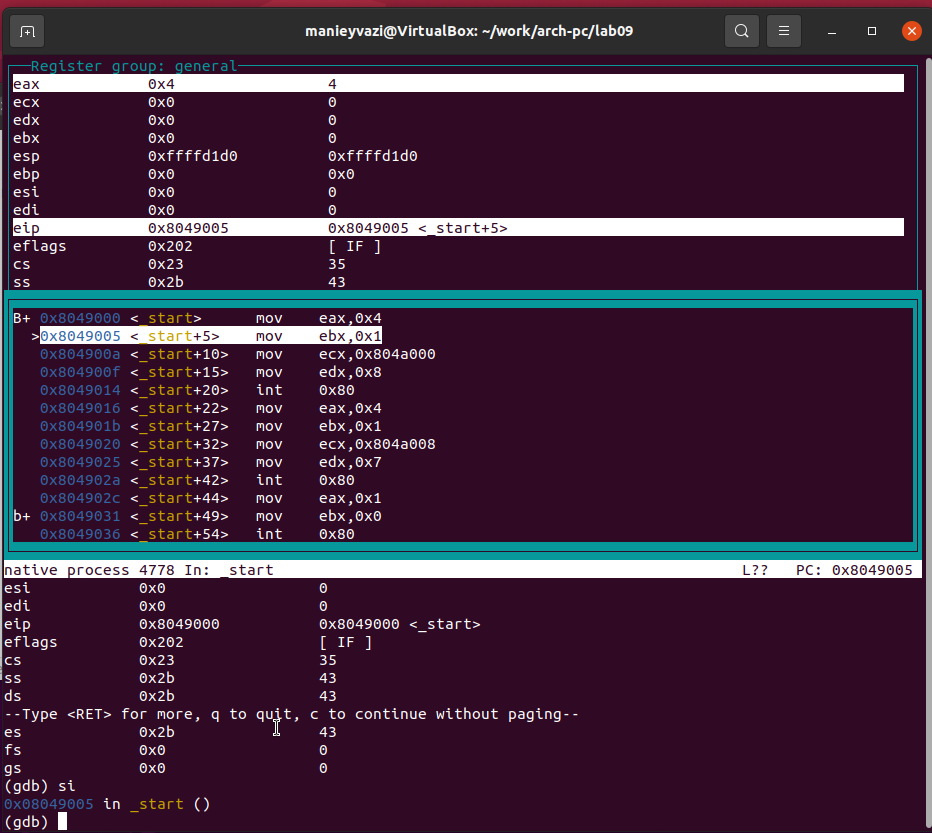{ #fig:010 width=70%, height=70% }

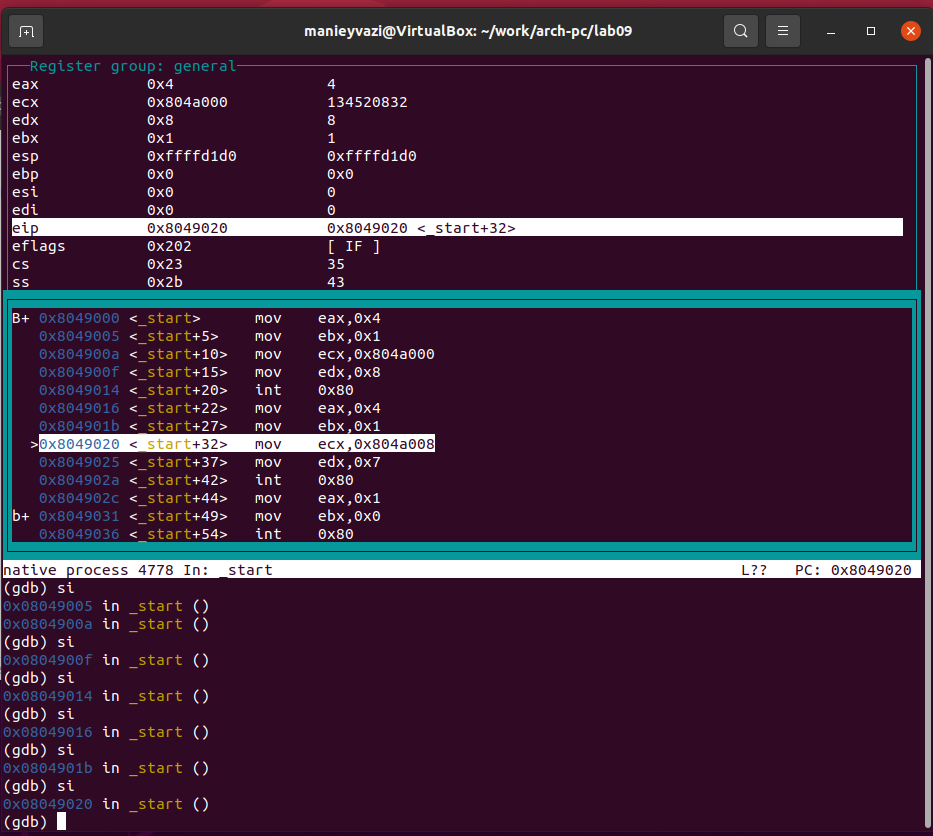{ #fig:011 width=70%, height=70% }

Я также просмотрел значение переменной msg1 по имени и изменил первый символ переменной с помощью команды set. (рис. [-@fig:012]) (рис. [-@fig:013])

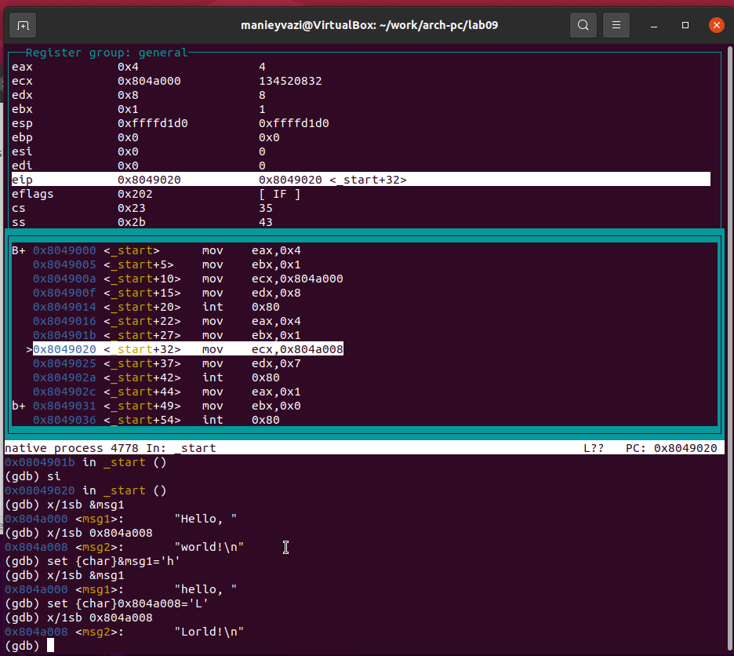{ #fig:012 width=70%, height=70% }

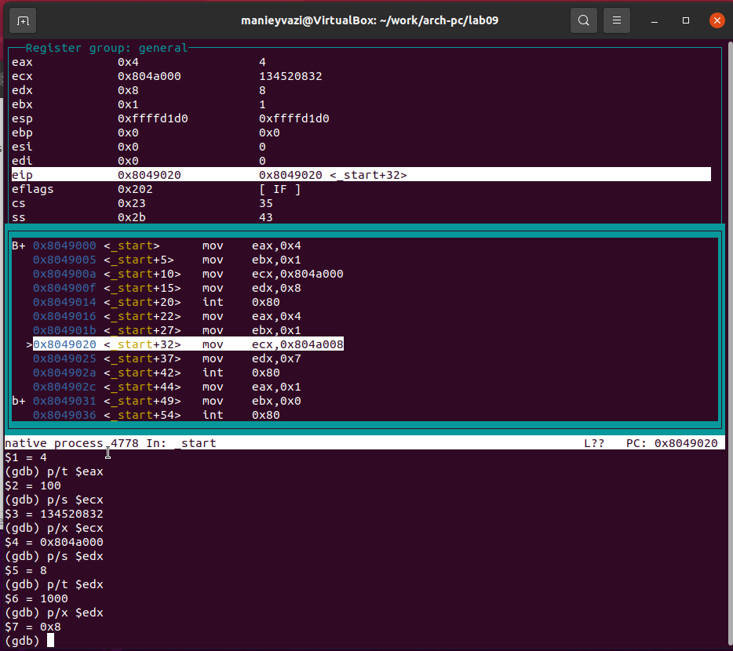{ #fig:013 width=70%, height=70% }

Для проверки программы с аргументами я скопировал файл lab8-2.asm из лабораторной работы №8, создал исполняемый файл и загрузил его в GDB с помощью ключа --args. Затем исследовал стек, где хранились адреса аргументов. (рис. [-@fig:015])

{ #fig:015 width=70%, height=70% }

## Задание для самостоятельной работы

Я модифицировал программу из лабораторной работы №8, добавив вычисление функции $f(x)$ в виде подпрограммы. (рис. [-@fig:016]) (рис. [-@fig:017])

{ #fig:016 width=70%, height=70% }

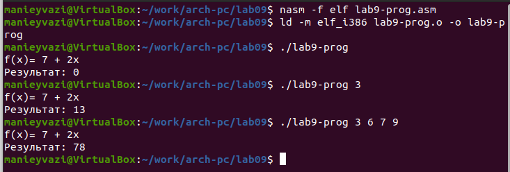{ #fig:017 width=70%, height=70% }

При запуске программы я обнаружил ошибку: результат вычислений был неверным. Анализ с помощью GDB показал, что аргументы инструкции add перепутаны, а по окончании программы значение регистра ebx вместо eax отправляется в edi. (рис. [-@fig:018]) (рис. [-@fig:019])

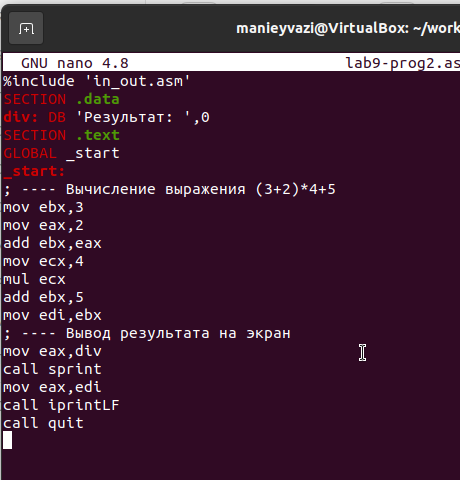{ #fig:018 width=70%, height=70% }

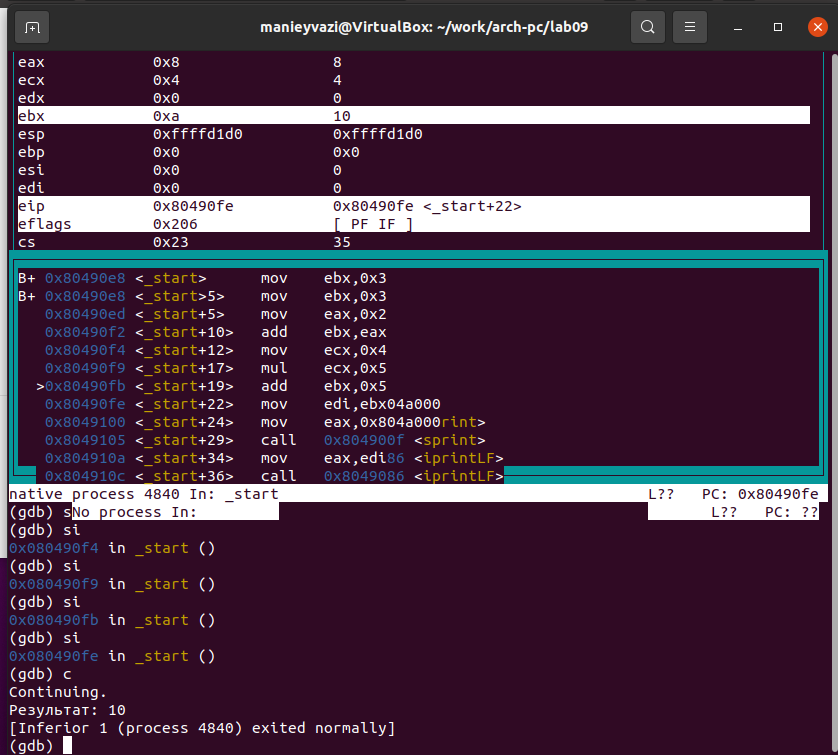{ #fig:019 width=70%, height=70% }

После исправления ошибок я проверил работу программы. (рис. [-@fig:020]) (рис. [-@fig:021])

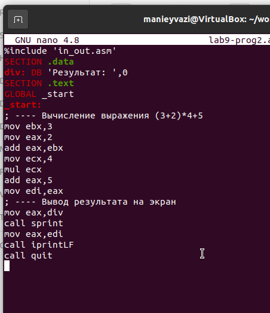{ #fig:020 width=70%, height=70% }

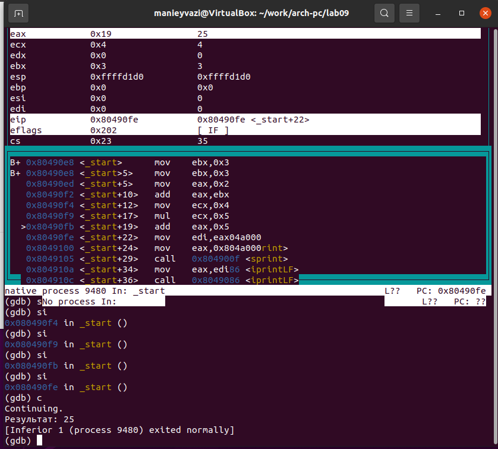{ #fig:021 width=70%, height=70% }

# Выводы

Я освоил работу с подпрограммами и отладчиком GDB, научился находить и исправлять ошибки в коде с помощью анализа стеков, регистров и дизассемблированного кода.
